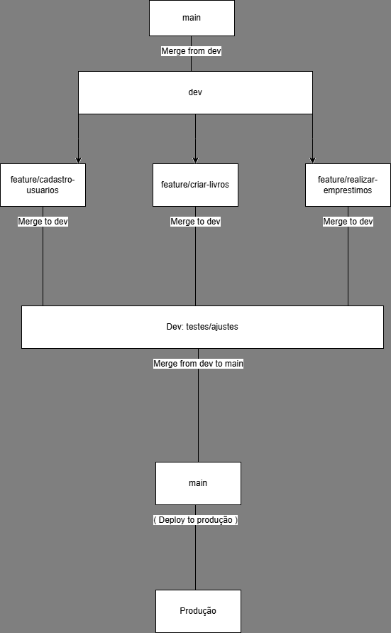
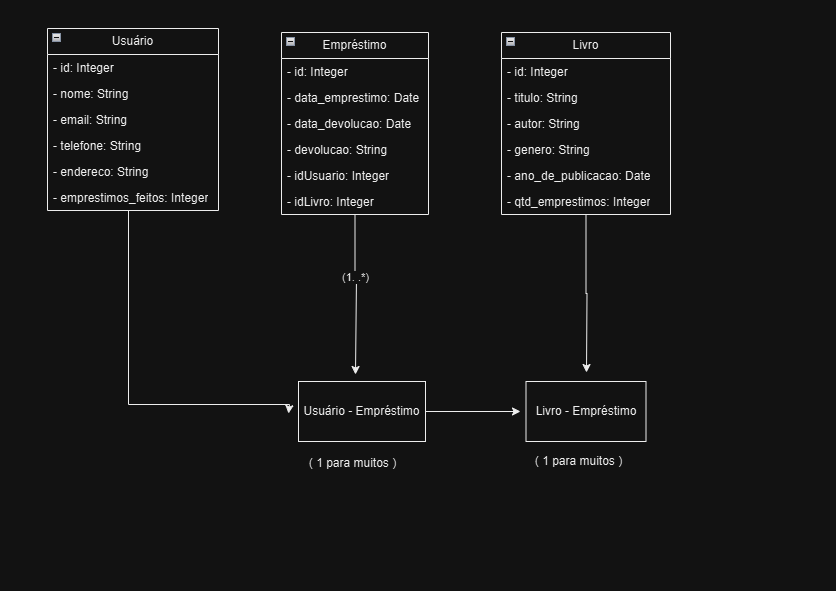
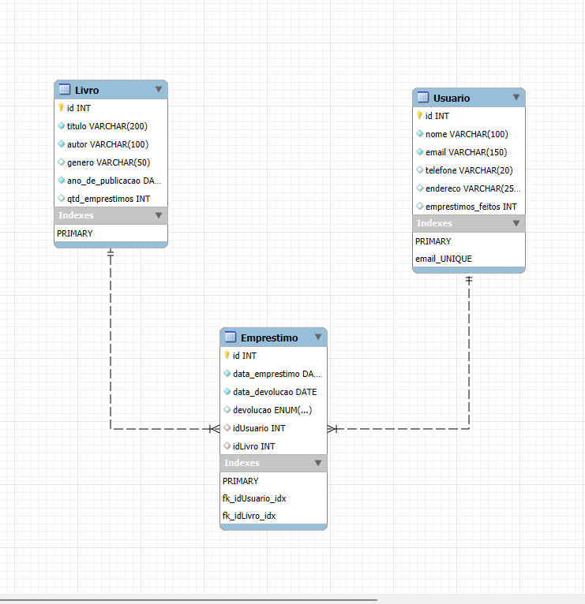
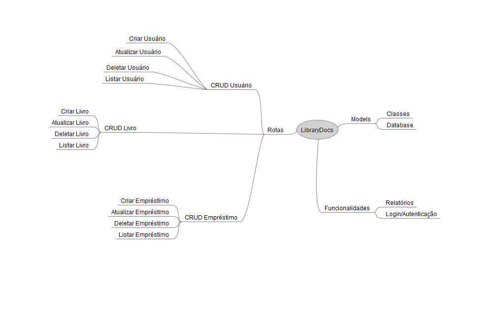
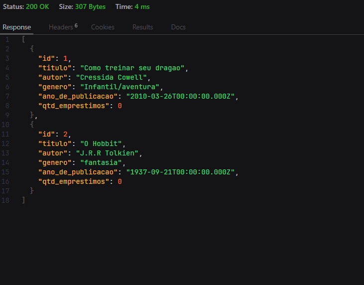

# Descrição do projeto
A LibraryAPi é uma aplicação RESTful desenvolvida para gerenciar livros em uma biblioteca.
O sistema permite realizar operações de CRUD (Create, Read, Update, Delete) para livros, usuários e empréstimos, além de gerar relatórios sobre o uso do sistema.

## Pré-requisitos
Antes de começar, você precisa ter as seguintes ferramentas instaladas:
- **Node.js** (v16 - *)
- **MySQL** (v8 - *)
- **MySQL Workbench**: Para gerenciamento do banco de dados.

## Funcionalidades
- Cadastro de livros.
- Registro de usuários.
- Controle de empréstimos e devoluções.

## Tecnologias e Frameworks utilizados
- **Node.js**: Ambiente de execução JavaScript
- **Express.js**: Framework para criar a API.
- **Sequelize**: ORM para interação com o banco de dados.
- **MySQL**: Banco de dados relacional utilizado para armazenar as informações.
- **dotenv**: Para gerenciar variáveis de ambiente de forma segura.
**Nodemon**: Utilitário para reiniciar automaticamente o servidor durante o desenvolvimento.
- **MySQL Workbench**: Ferramenta gráfica para modelagagem e administração do MySQL

## Como baixar e configurar o projeto
```
bash
git clone https://github.com/RaulSMuniz/LibraryAPI
cd LibraryAPI
npm install
npm install sequelize
npm install express
```  

Configure as variáveis de ambiente:
• No terminal, rode o comando npm install -g nodemon
• Crie um arquivo .env na raiz do projeto.
• Após criar o arquivo .env, adicione o seguinte conteúdo, substituindo pelos valores corretos do seu banco de dados:

DB_HOST=localhost
DB_USER=root
DB_PASSWORD=minha_senha
DB_NAME=minha_database

Para iniciar o projeto no modo de desenvolvimento com o **nodemon** use o seguinte comando:

nodemon

Por padrão, a API estará rodando em: http://localhost:3000 

## Fluxo de trabalho no repositório

Abaixo está o fluxograma do fluxo de trabalho utilizado no desenvolvimento do projeto:


## Estratégia de Branching:
- **main**: Branch principal (sempre estável e pronta para produção).
- **dev**: Branch para desenvolvimento principal (onde as novas funcionalidades são integradas).
- **feature branches** (ex: `feature/cadastro-usuarios`): Branches específicas para funcionalidades. Após o desenvolvimento, são mescladas na **dev**.

Quando o desenvolvimento na **dev** estiver pronto, ela será mesclada na **main**.

## Documentação de Apoio

- [Tutorial para Fluxo de Trabalho com Git](fluxo_trabalho.pdf): Explica os comandos Git e o fluxo de trabalho utilizado no projeto.

## Documentação de Apoio

- [Ferramentas, Bibliotecas e Frameworks](ferramentas_tecnologias.pdf): Documento explicando as tecnologias utilizadas no projeto.

## Autores:
- **Karollyne Santos**: Scrum Master
- **Rafael Viana**:  Gerente de configuração
- **Raul Sousa Muniz**: Desenvolvedor
- **João Barros**: Desenvolvedor
- **André Lopes**: Desenvolvedor
- **Milena de Oliveira**: Documentadora
- **Guilherme Andrade**: Documentador

## Licença 

Este projeto está licenciado sob a [Licença Creative Commons CC0 1.0](LICENSE)

## Diagrama de classes


## Diagrama ER



# Mapa mental



## Exemplo de resposta JSON da API (uma captura do Thunder Client)




